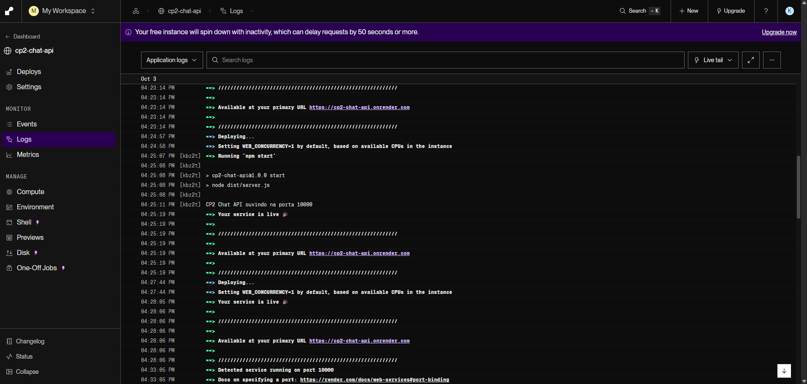

# 💬 CP2 Chat — React Native + Firebase + Grupos + Push Notifications

Aplicativo de chat **individual e em grupo em tempo real**, feito em **React Native + Expo + TypeScript**. A autenticação é feita **exclusivamente por e-mail e senha** no Firebase. As **notificações push** são enviadas por uma **API própria publicada na internet**, que aplica a política de notificações de cada grupo.

> **Checkpoint 2 — Mobile Development & IoT · FIAP**

---

## Integrantes

- RM556831 — Pedro Almeida e Camacho
- RM558540 — Renan Dias Utida
- RM559104 — Nicoli Amy Kassa
- RM558768 — Camila Pedroza da Cunha
- RM554592 — Isabelle Dallabeneta Carlesso

---

## 🔗 Links da entrega

| Item | Valor |
| --- | --- |
| Repositório | `https://github.com/<usuario>/CP2_Mobile_Development` |
| **API online (HTTPS, Render)** | `https://cp2-chat-api.onrender.com` |
| Health check | `https://cp2-chat-api.onrender.com/health` |

> A mesma URL da API está em [`app.json`](app.json) → `expo.extra.apiUrl`. Quem for corrigir não precisa configurar nada.

---

## 🧰 Tecnologias utilizadas

| Tecnologia | Versão | Uso |
| --- | --- | --- |
| **Expo SDK** | **55** (`expo ~55.0.0`) | Ambiente, build e módulos nativos |
| React Native | 0.83 | Interface nativa Android/iOS |
| React | 19.2 | Componentes e hooks |
| TypeScript | 5.9 (`strict`, sem `any`) | Tipagem do app e da API |
| Firebase JS SDK | 12.x | Auth, Firestore, Realtime Database, Storage |
| expo-notifications | 55.x | Permissão, Expo Push Token e toque na notificação |
| expo-image-picker | 55.x | Foto da galeria ou da câmera |
| expo-device | 55.x | Checagem de dispositivo físico para o push |
| React Navigation | 7.x | Pilhas de navegação |
| **API**: Node.js + Express | Node 22 / Express 4 | Envio seguro das notificações |
| **Render** | plano gratuito | Hospedagem da API com HTTPS e deploy automático |
| Firebase Admin SDK | 13.x | Validação do ID Token e leitura dos bancos na API |

---

## 🔥 Serviços Firebase e responsabilidade de cada um

| Serviço | Responsabilidade | Onde no código |
| --- | --- | --- |
| **Authentication** | Cadastro e login com e-mail e senha, recuperação da sessão (AsyncStorage), `uid` e logout. Outros provedores são recusados pelo app, pelas regras e pela API. | [`authService.ts`](src/services/authService.ts), [`AuthContext.tsx`](src/contexts/AuthContext.tsx) |
| **Realtime Database** | Todas as mensagens (individuais e de grupo), listeners em tempo real, prévia da última mensagem, estado da conexão (`.info/connected`) e o espelho de integrantes `groupMembers/` usado pelas regras. | [`chatService.ts`](src/services/chatService.ts), [`useChat.ts`](src/hooks/useChat.ts) |
| **Cloud Firestore** | Perfis (públicos e privados), grupos, integrantes, limite (`memberLimit`), política de notificações, conversas individuais, tokens dos dispositivos e controle de idempotência do push. | [`userService.ts`](src/services/userService.ts), [`groupService.ts`](src/services/groupService.ts), [`notificationService.ts`](src/services/notificationService.ts) |
| **Cloud Messaging (FCM)** | Entrega do push no Android. A API envia pelo Expo Push Service, que entrega no Android pelo FCM (credencial FCM V1 do projeto cadastrada no EAS) e no iOS pelo APNs. O payload leva `conversationId`, `conversationType` e `messageId`. | [`notificationSender.ts`](server/src/services/notificationSender.ts) |
| **Storage** *(desligado no momento)* | Fotos de perfil e de grupo. Somente a URL final vai para o Firestore. Veja *Armazenamento das fotos*. | [`storageService.ts`](src/services/storageService.ts) |

### Estrutura dos dados

**Cloud Firestore**

```text
users/{uid}                       uid, name, photoUrl, createdAt                    (público p/ autenticados)
users/{uid}/private/profile       email, phoneNumber, birthDate                     (somente o dono)
users/{uid}/devices/{deviceId}    token, platform, enabled, updatedAt               (somente o dono)
groups/{groupId}                  id, name, photoUrl, ownerId, memberIds, memberLimit,
                                  notificationPolicy, createdAt, updatedAt
directConversations/{uidA_uidB}   id, participantIds, createdAt
notificationDeliveries/{conv__msg} status, recipients, sent, failed                 (somente a API)
```

**Realtime Database**

```text
messages/{conversationId}/{messageId}
    id, conversationId, conversationType, senderId, text,
    target { type: 'conversation' } | { type: 'member', memberId },
    mentionedUserIds[], createdAt (serverTimestamp)
groupMembers/{groupId}/{uid}: true     ← escrito só pela API, a partir do Firestore
```

**Convenção de IDs.** Conversa individual = os dois `uid` ordenados e unidos por `_`, por exemplo `aB3_zX9`. Isso impede duas conversas para o mesmo par e conversa consigo mesmo. Grupo = ID automático do Firestore, que nunca contém `_`. As regras do Realtime Database usam essa diferença para saber o tipo da conversa.

---

## ▶️ Instalação e execução

### Pré-requisitos

- Node.js 20+ e npm
- Conta Expo e EAS CLI (`npm i -g eas-cli`)
- **Dispositivo físico** Android ou iOS para testar o push

### Aplicativo

```bash
git clone https://github.com/<usuario>/CP2_Mobile_Development.git
cd CP2_Mobile_Development
npm install

# A configuração do Firebase já está em firebaseConfig.json e a URL da API em app.json.

# Build de desenvolvimento (o push NÃO funciona no Expo Go desde o SDK 53):
npx expo run:android          # Android via cabo/emulador
npx expo run:ios              # iOS (macOS + Xcode)
# ou na nuvem:
eas build --profile development --platform android
```

Depois do build, `npx expo start --dev-client` sobe o bundler.

### API

```bash
cd server
npm install
cp .env.example .env   # nunca versionado; preencha com a conta de serviço
npm run dev            # http://localhost:3000/health (servidor local)
```

---

## 🔧 Configuração do Firebase

1. **Criar o projeto** no [Firebase Console](https://console.firebase.google.com/).
2. **Authentication** → Sign-in method → habilitar somente **E-mail/senha**.
3. **Firestore Database**, **Realtime Database** e **Storage** → criar os bancos.
4. **App Web**: Configurações do projeto → Seus aplicativos → Web. Copie o objeto de configuração para [`firebaseConfig.json`](firebaseConfig.json). Ele contém só a configuração do SDK cliente, sem nenhuma credencial administrativa.
5. **App Android** com o pacote `br.com.fiap.cp2chat`: baixe o `google-services.json` para a raiz do projeto. O [`app.config.ts`](app.config.ts) o inclui automaticamente.
6. **Publicar as regras** (versionadas no repositório):

   ```bash
   npm i -g firebase-tools
   firebase login
   firebase use <project-id>
   firebase deploy --only firestore:rules,database
   # com o Storage ativo (veja "Armazenamento das fotos"): --only firestore:rules,database,storage
   ```

---

## 🖼️ Armazenamento das fotos

**Serviço escolhido: Firebase Storage.**

> **Situação atual: envio de fotos desligado.** O Storage ainda não está ativo no projeto `espw-mobile` (projetos novos exigem o plano Blaze). Enquanto isso, `app.json` → `expo.extra.photoUploadEnabled` está `false`: o cadastro e o formulário de grupo não mostram o seletor de foto, nada é enviado ao Storage e todos usam a imagem padrão. Para religar: ative o Storage no Firebase Console, publique o [`storage.rules`](storage.rules) e troque a chave para `true`.

- A foto é escolhida pela galeria ou pela câmera ([`imagePickerService.ts`](src/services/imagePickerService.ts)), com pedido e tratamento das permissões.
- O arquivo é enviado para `users/{uid}/profile.jpg` ou `groups/{groupId}/photo.jpg`, e **apenas a URL** (`getDownloadURL`) é gravada no Firestore. Nada é salvo em Base64.
- O componente [`Avatar`](src/components/Avatar.tsx) mostra uma imagem padrão ([`default-avatar.png`](assets/default-avatar.png) / [`default-group.png`](assets/default-group.png)) quando não há foto ou quando a imagem falha ao carregar.
- Regras em [`storage.rules`](storage.rules):
  - imagens de até 5 MB;
  - somente o dono envia a foto de perfil;
  - somente o proprietário do grupo envia a foto do grupo (conferido no Firestore).

---

## 📱 Notificações no Android e no iOS

O app registra um **Expo Push Token** por aparelho em `users/{uid}/devices/{deviceId}`. A API envia pelo **Expo Push Service**, que entrega no Android via **FCM** e no iOS via **APNs**.

### Configuração (uma vez)

```bash
eas init                     # cria o projeto EAS e grava extra.eas.projectId no app.json
eas credentials              # Android → Push Notifications: FCM V1 → envie a chave da conta de serviço
                             # iOS → Push Notifications: deixe o EAS gerar a APNs Key
```

- **Android**: precisa do `google-services.json` na raiz e da chave **FCM V1** cadastrada no EAS (Firebase Console → Contas de serviço → gerar chave → `eas credentials`). O app cria o canal `messages` com importância alta e pede a permissão `POST_NOTIFICATIONS` (Android 13+).
- **iOS**: precisa de conta Apple Developer paga, build pelo EAS ou Xcode e aparelho físico. O EAS cria a chave APNs.
- **Expo Go não é suportado** para push. Use development build ou build nativo.

### Estados tratados

A tela de conversas mostra um aviso quando:

- a **permissão é negada**, com um botão que abre os Ajustes do sistema;
- o **dispositivo não tem token disponível**: simulador, projeto EAS não configurado ou falha ao obter o token;
- **não há conexão**.

Ao **tocar na notificação**, com o app em segundo plano ou fechado, o app abre a conversa indicada em `conversationId`/`conversationType`. Se essa conversa já está aberta na tela, o banner não aparece.

---

## 🔔 Política de notificações

Cada grupo tem `notificationPolicy`, escolhida pelo proprietário na criação ou edição. A API **calcula os destinatários no servidor** ([`recipientResolver.ts`](server/src/services/recipientResolver.ts)); o app nunca envia uma lista de destinatários.

| Política | Quem recebe o push |
| --- | --- |
| `all_group_messages` | Todos os integrantes ativos, **exceto o remetente**. |
| `mentioned_members` | Somente os integrantes mencionados com `@` (`mentionedUserIds`) ou escolhidos como destinatário (`target.memberId`). |
| `direct_messages_only` | Ninguém nas mensagens do grupo. Só conversas individuais geram push. |
| `disabled` | Ninguém: nenhuma mensagem do grupo gera push. |
| *(conversa individual)* | Sempre o outro participante. |

**Regras aplicadas a todas as políticas:**

- o remetente nunca recebe o próprio push;
- só participantes ou integrantes **atuais** recebem, então uma menção a quem saiu do grupo é descartada;
- o texto do push não expõe o conteúdo da mensagem. Exemplos: "Maria enviou uma mensagem." e "Maria mencionou você.";
- tokens recusados pelo serviço (`DeviceNotRegistered` ou formato inválido) são marcados como `enabled: false`;
- **idempotência:** o primeiro pedido cria atomicamente `notificationDeliveries/{conversationId}__{messageId}` com `create()`. Reenvios ou chamadas simultâneas da mesma mensagem recebem `status: "duplicate"` e não geram outro push.

Mensagens direcionadas a um integrante continuam no histórico do grupo e ficam visíveis a todos. Elas aparecem com "➜ Para Fulano" e ficam destacadas para quem foi mencionado.

---

## 🛡️ Limite de integrantes e concorrência

O `memberLimit` é definido na criação, é um inteiro entre 2 e 100 e conta o proprietário. A proteção tem três camadas:

1. **Interface:** mostra "X de Y integrantes · N vagas", impede marcar pessoas além das vagas, avisa "grupo sem vagas" e não permite um limite menor que a quantidade atual.
2. **Serviço ([`groupService.ts`](src/services/groupService.ts)):** adicionar, remover e alterar o limite rodam em **`runTransaction`**. A transação relê o documento e, se outra escrita acontecer no meio, o Firestore a **refaz** com os dados novos. Assim, duas adições simultâneas nunca somam acima do limite, e nenhuma sobrescreve a outra.
3. **Regras do Firestore ([`firestore.rules`](firestore.rules)):** toda criação ou atualização de grupo exige `memberIds.size() <= memberLimit`, `memberIds.size() >= 2`, sem duplicados e com o dono entre os integrantes. Mesmo um cliente adulterado que pule a interface e o serviço é recusado pelo servidor do Firestore, que avalia a regra sobre o documento final de forma atômica.

Somente o proprietário altera o grupo; `ownerId` e `createdAt` são imutáveis.

---

## 🔐 Regras de segurança

Arquivos versionados: [`firestore.rules`](firestore.rules), [`database.rules.json`](database.rules.json) e [`storage.rules`](storage.rules). Nenhuma regra é aberta.

### Firestore

- Todo acesso exige usuário autenticado **por e-mail/senha** (`sign_in_provider == 'password'`).
- `users/{uid}`: qualquer autenticado lê **só nome e foto** (necessários para a lista e a busca). Só o dono escreve, com campos e tipos validados.
- `users/{uid}/private/profile` (e-mail, celular, nascimento): **somente o dono**. Outra pessoa só vê esses dados pela API (`GET /users/:uid/profile`), que confere se existe **conversa individual ou grupo em comum**.
- `users/{uid}/devices`: somente o dono. Tokens nunca ficam públicos.
- `groups`: lê quem está em `memberIds`; cria quem se declara `ownerId`; **só o proprietário atualiza ou exclui**; limite validado em toda escrita.
- `directConversations`: o ID precisa ser `participantIds[0] + '_' + participantIds[1]` (ordenados); o criador precisa participar; os dois usuários precisam existir; não há atualização.
- `notificationDeliveries`: fechado para clientes.

### Realtime Database

- Negado por padrão (`.read`/`.write: false` na raiz).
- `messages/{conversationId}` só é lido e escrito por participantes:
  - conversa individual: o ID começa ou termina com `auth.uid`;
  - grupo: `groupMembers/{groupId}/{auth.uid} === true`.
- Cada mensagem só pode ser **criada** (não editada nem apagada). Também é obrigatório:
  - `senderId === auth.uid`;
  - `conversationType` coerente com o ID;
  - texto de 1 a 1000 caracteres;
  - `createdAt === now`;
  - `target.memberId` e `mentionedUserIds` apontando para integrantes atuais;
  - nenhum campo extra.
- `groupMembers` só é escrito pela API.

### Validações que dependem dos dois bancos → API

As regras do Realtime Database não conseguem consultar o Firestore. Por isso:

- A **API** copia os integrantes do Firestore para `groupMembers/{groupId}` (`POST /groups/:groupId/sync-members`) depois de criar o grupo, adicionar ou remover alguém. **Um integrante removido perde o acesso de leitura e envio no Realtime Database** assim que a sincronização termina. Além disso, a tela do chat reage na hora ao Firestore e bloqueia o envio.
- A **API** confere se a mensagem existe no Realtime Database, se o remetente é o usuário do token e se ele participa da conversa no Firestore antes de qualquer push.
- A **API** decide se um perfil pode ser visto, com base em conversa ou grupo em comum.

---

## 🌐 API online

- **Tecnologia:** Node.js 22 + Express 4 + TypeScript + Firebase Admin SDK. Código em [`server/`](server/).
- **Hospedagem:** **Render** (plano gratuito, HTTPS, deploy automático a cada push), usando o blueprint [`render.yaml`](render.yaml).
- **URL pública:** `https://cp2-chat-api.onrender.com`.
- **Alternativa:** a mesma API também pode ser publicada na **AWS** (Lambda + API Gateway). Veja [`server/aws/README.md`](server/aws/README.md).

### Endpoints

| Método e rota | Auth | Descrição |
| --- | --- | --- |
| `GET /health` | — | Disponibilidade: `200 {"status":"ok","firebase":"ready"}` ou `503` se faltarem credenciais. |
| `POST /notifications/messages` | Bearer ID Token | Body `{ conversationId, messageId }`. Valida o token, a mensagem, o remetente e a participação, aplica a política e envia o push. Resposta: `status: processed` com os totais, ou `status: duplicate`. |
| `GET /users/:uid/profile` | Bearer ID Token | Perfil completo, só com conversa ou grupo em comum (`403` caso contrário). |
| `POST /groups/:groupId/sync-members` | Bearer ID Token | Recria `groupMembers/{groupId}` no Realtime Database a partir do Firestore. |

Todas as rotas autenticadas validam o token com `verifyIdToken(token, true)`, que também rejeita tokens revogados, e recusam contas que não sejam de e-mail e senha. Os erros nunca expõem detalhes internos.

### Fluxo do push

```text
App grava a mensagem no Realtime Database ──► listeners atualizam a conversa aberta
      │
      └─► POST /notifications/messages { conversationId, messageId }  (Bearer ID Token)
             1. verifyIdToken (Admin SDK)
             2. mensagem existe no RTDB e senderId == uid do token
             3. remetente participa da conversa (Firestore)
             4. trava de idempotência (create atômico)
             5. destinatários = política do grupo ∩ integrantes atuais − remetente
             6. tokens ativos em users/{uid}/devices → Expo Push Service → FCM/APNs
             7. tokens inválidos → enabled: false
```

### Verificar a disponibilidade

```bash
curl https://cp2-chat-api.onrender.com/health
# {"status":"ok","firebase":"ready","timestamp":...}
```

> **O plano gratuito do Render "dorme"** depois de 15 min sem uso, e a primeira requisição leva cerca de 50 s. Por isso:
> - o app espera até 60 s pela API ([`apiClient.ts`](src/services/apiClient.ts)), então a primeira chamada demora, mas não falha;
> - um monitor gratuito do [UptimeRobot](https://uptimerobot.com) chama o `/health` a cada 5 min e mantém a API acordada durante a correção.

### Publicar a API (Render)

1. Crie uma conta em [render.com](https://render.com) entrando com o GitHub.
2. **New → Blueprint**, selecione este repositório e confirme. O [`render.yaml`](render.yaml) cria o serviço `cp2-chat-api` com `rootDir: server`. Se pedir `EXPO_ACCESS_TOKEN`, deixe em branco.
3. No serviço criado: **Environment → Secret Files → Add Secret File**:
   - *Filename:* `firebase-service-account.json`
   - *Contents:* cole o conteúdo inteiro do JSON da conta de serviço (Firebase Console → ⚙ Configurações do projeto → Contas de serviço → Gerar nova chave privada).
4. **Manual Deploy → Deploy latest commit** e espere ficar *Live*.
5. Abra `https://<seu-serviço>.onrender.com/health`. O esperado é `{"status":"ok","firebase":"ready"}`.
6. Coloque a URL em [`app.json`](app.json) → `expo.extra.apiUrl` e na tabela *Links da entrega* acima.
7. No [UptimeRobot](https://uptimerobot.com): **New monitor → HTTP(s)**, URL do `/health`, intervalo de 5 min.

A cada push na branch principal o Render publica a nova versão sozinho. Logs: painel do serviço → **Logs**.

### Variáveis de ambiente da API

| Variável | Onde | Conteúdo |
| --- | --- | --- |
| `FIREBASE_SERVICE_ACCOUNT_FILE` | `render.yaml` | `/etc/secrets/firebase-service-account.json`, o Secret File do passo 3 |
| `FIREBASE_DATABASE_URL` | `render.yaml` | URL do Realtime Database (pública, a mesma do `firebaseConfig.json`) |
| `EXPO_ACCESS_TOKEN` | painel do Render | Opcional: token do Expo, se "Enhanced Security for Push" estiver ativo |
| `FIREBASE_PROJECT_ID` · `FIREBASE_CLIENT_EMAIL` · `FIREBASE_PRIVATE_KEY` | — | Alternativa ao arquivo, para hospedagens sem Secret Files |

**Permissões mínimas (opcional).** A chave padrão gerada pelo Firebase Console (`firebase-adminsdk`) já funciona. Para reduzir o acesso da API, crie uma conta de serviço própria no Google Cloud IAM só com estes papéis:

- `Cloud Datastore User` / Usuário do Cloud Datastore (`roles/datastore.user`): Firestore;
- `Firebase Realtime Database Admin` / Administrador do Firebase Realtime Database (`roles/firebasedatabase.admin`);
- `Firebase Authentication Viewer` / Leitor do Firebase Authentication (`roles/firebaseauth.viewer`): a API usa `verifyIdToken(token, true)`, que consulta o usuário para detectar sessões revogadas; sem esse papel toda chamada autenticada responde 401.

Com o console em português os nomes aparecem traduzidos. O caminho mais curto é criar tudo pelo **Cloud Shell** (ícone `>_` no topo do Google Cloud Console), usando os IDs dos papéis:

```bash
PROJECT_ID=seu-project-id
SA=cp2-chat-api@$PROJECT_ID.iam.gserviceaccount.com
gcloud config set project $PROJECT_ID
gcloud iam service-accounts create cp2-chat-api --display-name="CP2 Chat API"
for ROLE in roles/datastore.user roles/firebasedatabase.admin roles/firebaseauth.viewer; do
  gcloud projects add-iam-policy-binding $PROJECT_ID --member="serviceAccount:$SA" --role="$ROLE" --condition=None
done
gcloud iam service-accounts keys create cp2-chat-api.json --iam-account=$SA
cloudshell download cp2-chat-api.json   # baixa a chave; depois apague a cópia: rm cp2-chat-api.json
```

**Nenhuma credencial administrativa está no app nem no GitHub**; veja o [`.gitignore`](.gitignore).

---

## 🗂️ Estrutura do projeto

```text
.
├── App.tsx                       # SafeArea → AuthProvider → RootNavigator
├── app.json / app.config.ts      # Config Expo (plugins, apiUrl, google-services)
├── firebaseConfig.json           # Config do SDK cliente (sem segredos)
├── firestore.rules · database.rules.json · storage.rules · firebase.json
├── render.yaml                   # Deploy da API no Render
├── .env.example                  # Variáveis opcionais do app
├── assets/                       # Ícones e imagens padrão de perfil/grupo
├── src/
│   ├── components/   AppButton, AppTextInput, Avatar, ChatInput, ChatMessageBubble,
│   │                 ConversationItem, EmptyState, ErrorMessage, GroupMemberItem,
│   │                 Loading, NoticeBanner, PhotoPicker, PolicySelector, ScreenContainer, UserItem
│   ├── config/       appConfig.ts (URL da API, projeto EAS)
│   ├── contexts/     AuthContext.tsx
│   ├── hooks/        useAuth, useChat, useConversations, useGroups, useContacts (usuários),
│   │                 useNotifications, useUserProfile, useConnection
│   ├── navigation/   RootNavigator.tsx, NotificationStatusContext.tsx
│   ├── screens/      Login, Register, Conversations, Users, GroupForm, Chat,
│   │                 Profile, GroupMembers, FirebaseSetup
│   ├── services/     firebase, authService, userService, groupService, chatService,
│   │                 notificationService, storageService, imagePickerService, apiClient
│   ├── types/        user, chat, group, notification, navigation
│   └── utils/        conversation (IDs), groupValidation, validation, format, errors, parse, chatRules
└── server/
    ├── .env.example
    ├── aws/                      # Alternativa: deploy na AWS (README, template CloudFormation)
    ├── scripts/aws.mjs           # npm run deploy:aws / destroy:aws
    └── src/
        ├── app.ts                # App Express (rotas, erros)
        ├── server.ts             # Servidor HTTP (Render e npm run dev)
        ├── lambda.ts             # Entrada na AWS Lambda (alternativa)
        ├── middleware/authenticate.ts
        ├── routes/       notifications.ts, users.ts, groups.ts
        ├── services/     firebaseAdmin, conversationAccess, recipientResolver,
        │                 notificationSender, deliveryLock
        ├── types/group.ts
        └── utils/        parse.ts, httpError.ts
```

---

## 🖥️ Telas

| Tela | Principais recursos |
| --- | --- |
| **Login** | E-mail, senha, loading e erros compreensíveis; acesso ao cadastro. |
| **Cadastro** | Foto (galeria ou câmera), nome, e-mail, celular com máscara, nascimento (DD/MM/AAAA), senha e confirmação. |
| **Conversas** | Individuais e grupos com selo do tipo, prévia e horário da última mensagem, "Nova conversa", "Novo grupo", estado vazio, avisos de conexão e de push, logout. |
| **Usuários** | Busca por nome; o próprio usuário não aparece. Modo conversa (abre ou reabre a conversa) e modo seleção de integrantes, com contador de vagas. |
| **Grupo (criar/editar)** | Nome, foto, limite, integrantes atuais e vagas, política de push. O proprietário adiciona e remove integrantes. |
| **Chat** | Foto e nome no topo (toque → perfil ou integrantes); mensagens enviadas e recebidas; autor nos grupos; `@` para mencionar; "Para:" para direcionar; tempo real; rolagem; estado vazio; falha no envio. |
| **Integrantes** | Foto do grupo, capacidade, política e integrantes (toque → perfil). |
| **Perfil** | Foto, nome, e-mail, celular e nascimento, com "Não informado" para campos ausentes; acesso só com conversa ou grupo em comum. |

---

## 📸 Prints das telas

Os arquivos ficam em [`docs/prints/`](docs/prints/); veja os nomes esperados em [`COMO-ADICIONAR.md`](docs/prints/COMO-ADICIONAR.md).

| Login | Cadastro | Conversas |
| --- | --- | --- |
|  |  |  |

| Grupo | Chat em grupo | Perfil |
| --- | --- | --- |
|  |  |  |

### Evidência de notificação recebida

| Push na bandeja do sistema | Registro na API |
| --- | --- |
|  |  |

---

## ✅ Tratamento de erros e estados

- **Loading e estados vazios:** loading em sessão, conversas, usuários, grupo, mensagens e perfil; estado vazio para "nenhuma conversa", "nenhum usuário disponível" e "conversa sem mensagens".
- **Erros de autenticação e sessão:** credenciais inválidas, e-mail já cadastrado e sessão expirada (401 da API) viram mensagens em português ([`errors.ts`](src/utils/errors.ts)), sem códigos internos.
- **Erros de grupo:** grupo sem vagas, limite menor que a quantidade atual, ação de quem não é proprietário e integrante removido (o chat é bloqueado).
- **Erros de mensagem:** falha no envio mantém o texto no campo; falha no push é avisada sem desfazer a mensagem.
- **Notificações e conectividade:** permissão negada, dispositivo sem token, falha ao registrar o token e perda de conexão (`.info/connected`).
